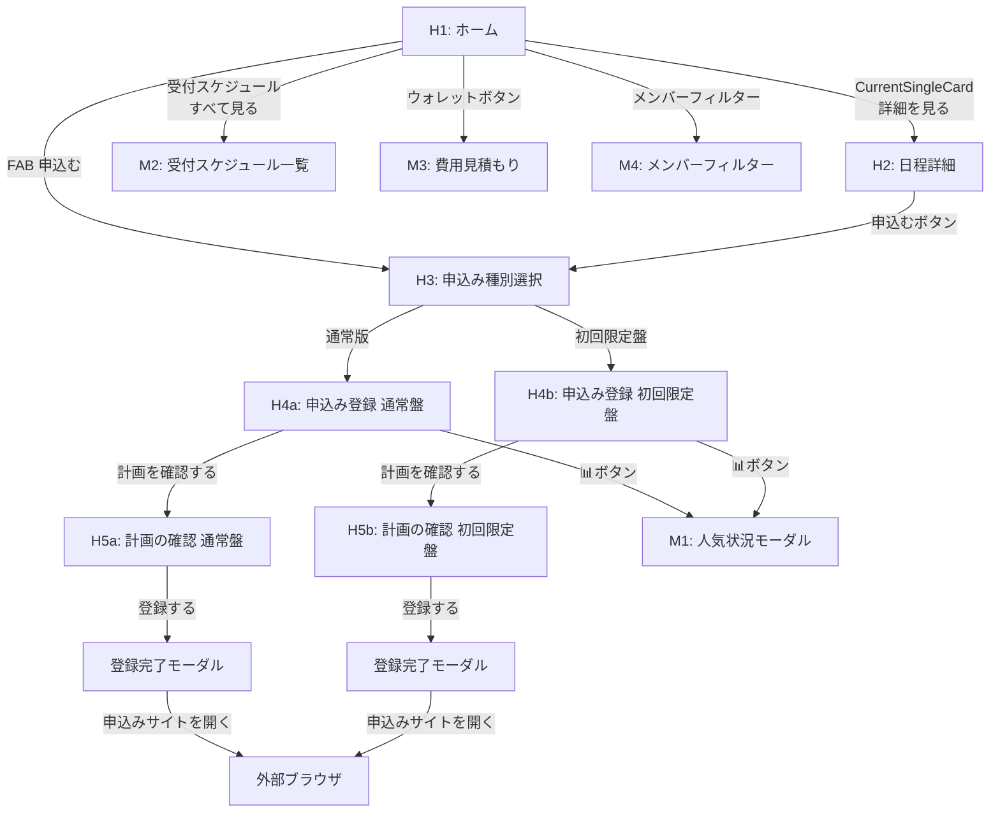
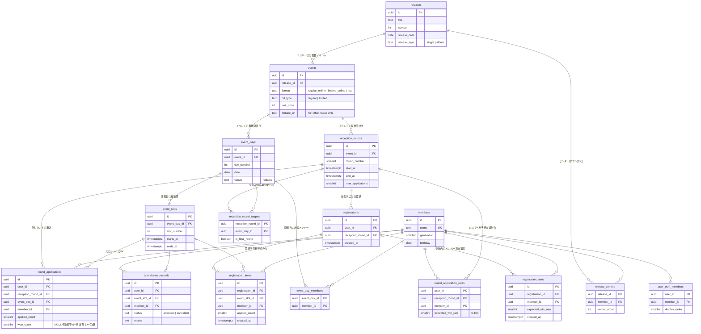

# Home タブ 設計書

## 1. 対象画面一覧

Home タブから到達可能な画面群を対象とする。

| # | 画面名 | pen node | 種別 | 概要 |
|---|--------|----------|------|------|
| H1 | ホーム | `QiFyY` | タブ画面 | 直近リリースのサマリー・受付スケジュール・チケット情報・申込み状況ヒートマップ |
| H2 | 日程詳細 | `hvdbv` | push | イベント形式ごとの開催日程・タイムスケジュール一覧 |
| H3 | 申込み種別選択 | `Co33m` | push | 通常版 or 初回限定盤の選択 |
| H4a | 申込み登録 (通常盤) | `bxh4x` | push | メンバー選択 → 日程×部ごとの枚数入力 |
| H4b | 申込み登録 (初回限定盤) | `CTY7w` / `8asKV` | push | シリアル枚数 + 受付次 + メンバー + 形式トグル (オンライン/リアル同時管理) + 枚数入力。1 画面で両形式を切替え |
| H5a | 計画の確認 (通常盤) | `pbdtd` | push | 申込内容・予想当選割合・見込み費用の確認 → 登録 |
| H5b | 計画の確認 (初回限定盤) | `nTu5v` | push | シリアル枚数の確認 → 登録 |
| M1 | 人気状況モーダル | `1d6N0` | modal | メンバー×日程×部のヒートマップ (◎○△×) |
| M2 | 受付スケジュール一覧 | `s46Wt` | bottom sheet | 全受付次のリスト (通常盤 + 初回限定盤) |
| M3 | 費用見積もり | `3g7NX` | bottom sheet | シリアル購入費 + 当選分支払い + 支払済の内訳 |
| M4 | メンバーフィルター | `gCLhf` | tooltip | H1 のヒートマップ用メンバー絞り込み |

---

## 2. 画面遷移



---

## 3. 画面別コンポーネント構成

### H1: ホーム画面

**構成**: `layout: none` で MainStack + FAB を重ねた構造。

```
Home (QiFyY)
├── MainStack (bJSLU) [layout: vertical]
│   ├── StatusBar
│   ├── Header
│   │   ├── titleText: "ミーグリ"
│   │   └── walletButton [icon: wallet] → M3 を開く
│   ├── ScrollContent (awFlT) [layout: vertical, gap: 16, padding: 0 16]
│   │   ├── CurrentSingleCard (zTjOl)
│   │   │   背景画像 + グラデーションオーバーレイ
│   │   │   ├── header
│   │   │   │   ├── singleLabel: "17thシングル"
│   │   │   │   ├── singleTitle: "Kind of love"
│   │   │   │   └── detailBtn: "詳細を見る →" → H2 へ遷移
│   │   │   └── statsRow [4 つの統計値]
│   │   │       ├── statA: "8" / "当選枠" — リリース全体の当選合計
│   │   │       ├── statB: "24" / "申込枠" — リリース全体の申込合計
│   │   │       ├── statC: "8" / "使用済シリアル" — 初回限定盤のみ。結果確定済みの枚数
│   │   │       └── statD: "16" / "申込中シリアル" — 初回限定盤のみ。結果未確定の枚数
│   │   │       ※ 投入額は M3 (支払い見込みモーダル) に移動
│   │   │
│   │   ├── ReceptionSection (v0hAR)
│   │   │   ├── receptionHeader: "受付スケジュール" / "すべて見る" → M2 を開く
│   │   │   └── RoundCard (gyyQD) [直近の受付次を 1 件表示]
│   │   │       ├── roundIndicator: "4次" [丸バッジ]
│   │   │       ├── roundDate: "4/30 (水) 14:00 〜 5/1 (木) 14:00"
│   │   │       ├── roundMeta: "申込上限 5回 · 通常盤オンライン"
│   │   │       └── roundBadge: "受付前"
│   │   │
│   │   ├── TicketInfoSection (6hPLG)
│   │   │   └── TicketAccordion (R3v9o) [展開/折りたたみ]
│   │   │       ├── accHeader: "チケット情報" + "当選 8枚" バッジ
│   │   │       └── accBody [形式別セクション]
│   │   │           ├── normalOnlineSection: "通常版 オンラインミーグリ" (6枚)
│   │   │           │   └── 行リスト (r1〜r6): 日時 / 部の時間帯 / メンバー名
│   │   │           ├── realMeetSection: "リアルミーグリ" (1枚)
│   │   │           │   └── 行リスト: 日時 / 部の時間帯 / メンバー名
│   │   │           └── feOnlineSection: "初回限定盤 オンラインミーグリ" (1枚)
│   │   │               └── 行リスト: 日時 / 部の時間帯 / メンバー名
│   │   │           ※ ステータスバッジなし。行タップで遷移なし
│   │   │
│   │   └── DayTableSection (Y0N8X)
│   │       ├── sectionHeader: "申し込み状況"
│   │       ├── memberFilter: "全員 ▼" → M4 を開く
│   │       ├── normalTable (6svgx) [通常版オンラインミーグリ]
│   │       │   ├── tableTitle: "通常版 オンラインミーグリ"
│   │       │   ├── heatmapGrid [6列(DAY) × 6行(部)]
│   │       │   │   セル値: "当選(申込中)" 形式 例: "1(1)"
│   │       │   │   色分け: 緑=#D4EDDA / 黄=#FFF5A0 / グレー=#E8EDF2
│   │       │   └── legend: "数値の見方: 当選(申込中)"
│   │       └── feTable (RDrJb) [初回限定盤ミーグリ]
│   │           ├── feTableTitle: "初回限定盤 ミーグリ"
│   │           ├── realSubheader: "リアルミーグリ" [2列(会場) × 4行(部)]
│   │           ├── onlineSubheader: "初回限定オンライン" [1列(日程) × 4行(部)]
│   │           └── feLegend: "数値の見方: 当選(申込中)"
│   │
│   └── BottomTabBar [ref: egH34]
│
└── FAB (SpK4F) [position: absolute, 右下]
    ├── fabIcon: icon "plus"
    └── fabText: "申込む" → H3 へ遷移
```

#### ヒートマップグリッドの色分けルール

| セル値パターン | 背景色 | テキスト色 | 意味 |
|--------------|--------|-----------|------|
| `N(0)` where N>0 | `#D4EDDA` (緑) | `#2D6A3E` | 当選あり / 申込中なし |
| `N(M)` where N>0, M>0 | `#D4EDDA` (緑) | `#2D6A3E` | 当選あり / 申込中あり |
| `0(M)` where M>0 | `#FFF5A0` (黄) | `#856404` | 当選なし / 申込中あり (結果待ち) |
| `0(0)` | `#E8EDF2` (グレー) | `#8494A7` | 未申込 |

---

### H2: 日程詳細画面

**目的**: 各イベント形式の開催日程・タイムスケジュールを一覧表示する (マスターデータから動的生成)。申込み導線もここから。

※ 以下のツリーは pen 図のサンプルデータ。実際の時間帯・会場名・部数は `event_slots` / `event_days` のマスターデータに依存する。

```
EventDetail (hvdbv)
├── statusBar
├── navBar
│   ├── navBack: icon "arrow-left"
│   └── navTitle: "日程詳細"
└── scroll (ohzwO) [layout: vertical, gap: 16]
    ├── onlineSection [通常版 オンラインミーグリ]
    │   ├── onlineHeader: icon "monitor" + "通常版 オンラインミーグリ"
    │   ├── dateListCard [開催日程リスト]
    │   │   └── DAY1〜DAY6 の日付一覧 (曜日色分け: 土=青, 日=赤)
    │   ├── notice [注意書き]
    │   │   "全日程共通のタイムスケジュールです。
    │   │    受付開始は各部の開始15分前、受付終了は各部の終了15分前です。"
    │   └── day1Card [タイムテーブル]
    │       ├── ヘッダー行: 部 / 時間 / 受付
    │       └── 1部〜6部 (時間帯は event_slots マスターデータから動的表示)
    ├── realSection [リアルミーグリ]
    │   ├── realHeader: icon "map-pin" + "リアルミーグリ"
    │   ├── realDateCard [開催日程 + 会場名]
    │   │   ├── DAY1: 7/26(土) 東京ビッグサイト
    │   │   └── DAY2: 8/16(土) 梅田クリスタルホール
    │   ├── venueCard [会場情報]
    │   │   ├── 東京: 東京ビッグサイト
    │   │   └── 大阪: 梅田クリスタルホール
    │   └── realScheduleCard [タイムテーブル]
    │       ├── notice (同上)
    │       └── 1部〜4部 (時間帯は event_slots マスターデータから動的表示)
    ├── feOnlineSection [初回限定盤 オンラインミーグリ]
    │   ├── feOnlineHeader: icon "star" + "初回限定盤 オンラインミーグリ"
    │   ├── feOnlineDateCard [開催日程リスト]
    │   │   └── DAY1 の日付 (1日程)
    │   └── feOnlineScheduleCard [タイムテーブル]
    │       ├── notice (同上)
    │       └── 1部〜4部
    └── applyBtn: Button label="申込む" → H3 へ遷移
```

---

### H3: 申込み種別選択画面

```
ApplyTypeSelect (Co33m)
├── navBar: "arrow-left" + "申込み登録"
└── content
    ├── headerTitle: "申込みの種別を選択"
    ├── headerSub: "17thシングル「Kind of love」"
    ├── card1Online → H4a へ遷移
    │   ├── icon "monitor" (bg: #D9EFF8)
    │   ├── "通常版 オンラインミーグリ"
    │   ├── "forTUNE music で申込み"
    │   └── "全6日程 · 各6部"
    └── card2FirstEdition → H4b へ遷移
        ├── icon "star" (bg: #FFF5A0)
        ├── "初回限定盤 ミーグリ"
        ├── "初回限定盤CDのシリアルで申込み"
        └── "オンライン · リアル · 1日程"
```

---

### H4a: 申込み登録 (通常盤)

```
ApplyRegister (bxh4x)
├── navBar
│   └── navBack + navTitle: "申込み登録"
└── formScroll
    ├── popularityBtn: icon "chart-bar" (Phosphor ChartBar) → M1 を開く
    ├── roundField: "受付次数" / [第4次 ▼] ドロップダウン
    │   ※ 全受付次を選択可能。デフォルト: 受付中があればそれ、なければ次の受付次
    ├── memberField: "メンバー" / [坂井新奈 ▼] ドロップダウン
    ├── day1Section 〜 day6Section [各日程カード]
    │   ├── dayBadge: "DAY1" (pill, #D9EFF8)
    │   ├── dayTitle: "5/31 (日)"
    │   └── slot1〜slot6 [各部の入力行]
    │       ├── slotLabel: "1部"
    │       ├── statusBadge: 完売/混雑/やや混雑/余裕あり
    │       └── stepper: [-] N [+]  (完売時は "—" でステッパー非表示)
    ├── noteCard: "登録した情報は匿名で集計され…"
    └── submitButton: "計画を確認する" → H5a へ遷移
```

#### 人気度ステータスバッジ

| テキスト | バッジ背景 | テキスト色 |
|---------|----------|-----------|
| 完売 | `#FFE0E0` | `#C0392B` |
| 混雑 | `#FFE0E0` | `#E5484D` |
| やや混雑 | `#FFF5A0` | `#856404` |
| 余裕あり | `#D4EDDA` | `#2D6A3E` |

---

### H4b: 申込み登録 (初回限定盤)

1 画面で初回限定オンラインとリアルの **両方を同時に管理** する。形式トグルは表示切替ではなく、どちらの枠に投げるかのフィルター。シリアル 1 枚でオンライン・リアルどちらにも投票できる。

```
ApplyRegisterFirstEdition (CTY7w / 8asKV)
├── navBar: "申込み登録"
└── formScroll
    ├── popularityBtn: icon "chart-bar" (Phosphor ChartBar) → M1 を開く
    ├── serialCodeCount: "使用シリアルコード数" / "9枚"
    │   ※ 実態は応募口数の合計 (= applied_count の合算)。物理シリアル枚数とは一致しない場合がある
    ├── roundField: "受付次数" / [1次 ▼]
    ├── memberField: "メンバー" / [坂井新奈 ▼]
    ├── typeField: "形式"
    │   └── typeToggle: [リアルミーグリ] [初回限定オンライン]
    │       ※ トグルは表示する日程セクションを切替えるだけで、両形式の入力内容は常に保持される
    │       ※ シリアル 1 枚でオンライン・リアルどちらにも応募可能
    │
    │   [初回限定オンライン 選択時]
    │   └── day1Section [DAY1 バッジ, 1日程, 4部]
    │
    │   [リアルミーグリ 選択時]
    │   ├── day1Section [地名バッジ: "大阪" + map-pin, 4部]
    │   └── day2Section [地名バッジ: "東京" + map-pin, 4部]
    │
    ├── noteCard: "登録した情報は匿名で集計され…"
    └── submitButton: "計画を確認する" → H5b へ遷移 (両形式の入力内容をまとめて送信)
```

---

### H5a: 計画の確認 (通常盤)

```
ApplyPlanConfirm (pbdtd)
├── navBar: "計画の確認"
└── scrollContent
    ├── "支払い済み" セクション
    │   └── paidCard: "当選済みの枠" / "12枚 × ¥1,200" → "¥14,400"
    ├── "今回の申込み" セクション [メンバー別カード]
    │   ├── memberCard1: "坂井新奈" (6枚)
    │   │   ├── スロット一覧 (DAYバッジ + 日付 + 部 + 枚数)
    │   │   └── 予想当選割合: [-] 50% [+] ステッパー
    │   └── memberCard2: "正源司陽子" (4枚)
    │       ├── スロット一覧
    │       └── 予想当選割合: [-] 20% [+] ステッパー
    ├── "見込み費用" セクション
    │   ├── 坂井新奈: ¥7,200 × 50% → ¥3,600
    │   ├── 正源司陽子: ¥4,800 × 20% → ¥960
    │   └── 見込み費用 合計: ¥4,560
    ├── サマリーカード (bg: #D9EFF8)
    │   ├── 支払い済み: ¥14,400
    │   ├── 見込み費用: ¥4,560
    │   └── 合計見込み: ¥18,960
    └── submitButton: "登録する"

    登録完了モーダル (overlay)
    ├── ✓ "登録しました"
    ├── ⚠ "重要: この登録だけでは申込みは完了しません。
    │       必ず申込みサイトから手続きを行ってください。"
    ├── "申込みサイトを開く" [外部リンク]
    └── "閉じる"
```

### H5b: 計画の確認 (初回限定盤)

H5a との差分のみ記載。

```
ApplyPlanConfirmFE (nTu5v)
└── scrollContent
    ├── "使用済みシリアルコード" セクション (金額ではなく枚数)
    │   └── usedCard: "このイベントで当選済みの枠" / "オンライン5枚 + オフライン3枚" → "8枚"
    ├── "今回の申込み" セクション [形式別カード]
    │   ├── onlineCard: badge "初回限定オンライン" + スロット一覧
    │   └── offlineCard: badge "リアルミーグリ" + スロット一覧 (地名バッジ付き)
    ├── "合計" カード [シリアル枚数の集計]
    │   ├── 使用済みシリアルコード: 8枚
    │   ├── 今回の申込み: 8枚
    │   └── 合計シリアルコード数: 16枚
    └── submitButton: "登録する"
    ※ 「予想当選割合」「見込み費用」はなし (シリアルは購入済みのため)
    ※ v1: 使用済みシリアル数はハードコード 0。実データ連動は未実装
```

---

### M1: 人気状況モーダル

```
ApplyRegisterModal (1d6N0) — H4a/H4b 上にオーバーレイ表示
└── heatmapModal
    ├── modalHeader: "人気状況" + [✕] 閉じる
    ├── memberRow: アバター + "坂井新奈" + "17thシングル"
    ├── heatmapTable [6列(DAY) × 6行(部)]
    │   セル: ◎ (余裕あり) / ○ (やや混雑) / △ (混雑) / × (完売)
    ├── legend: ● 余裕あり / ● やや混雑 / ● 混雑 / ● 完売
    └── updated: "完売情報: 4/29 10:30 更新"
```

#### 人気度シンボルと色

| シンボル | 意味 | セル背景 | テキスト色 |
|---------|------|---------|-----------|
| ◎ | 余裕あり | `#D4EDDA` | `#2D6A3E` |
| ○ | やや混雑 | `#FFF5A0` | `#856404` |
| △ | 混雑 | `#FFE0E0` | `#E5484D` |
| × | 完売 | `#B8C5D0` | `#14253A` |

---

### M2: 受付スケジュール一覧

```
ReceptionSchedule (s46Wt) — ボトムシート
└── ModalSheet [cornerRadius: 上24, fill: #FFFFFF]
    ├── handleBar [ドラッグハンドル]
    ├── modalHeader: "受付スケジュール" + [✕]
    └── scrollContent
        ├── "通常盤 オンラインミーグリ" セクション (icon: monitor, #5BBEE5)
        │   ├── 1次: 4/2 12:00〜4/3 12:00 / 上限2回 / [終了]
        │   ├── 2次: 4/9 12:00〜4/10 12:00 / 上限3回 / [終了]
        │   ├── 3次: 4/16 12:00〜4/17 12:00 / 上限4回 / [受付中]
        │   └── 4次: 4/30 14:00〜5/1 14:00 / 上限5回 / [受付前]
        └── "初回限定盤 ミーグリ" セクション (icon: star, #F59E0B)
            └── 1次: 5/7 12:00〜5/8 12:00 / 上限3回 / [受付前]
```

#### 受付ステータスバッジ

| テキスト | バッジ背景 | テキスト色 |
|---------|----------|-----------|
| 終了 | `#E8EDF2` | `#8494A7` |
| 受付中 | `#D4EDDA` | `#2D6A3E` |
| 受付前 | `#E8F4FA` | `#5A6B78` |

---

### M3: 費用見積もり

```
PaymentModal (3g7NX) — ボトムシート
└── ModalSheet
    ├── handleBar
    ├── modalHeader: "費用見積もり" + [✕]
    └── modalContent
        ├── totalCard (bg: #E8F4FA)
        │   ├── "合計見積もり金額"
        │   ├── "¥62,960" [大きく表示]
        │   └── "確定分 + 見込み分"
        ├── serialSection: "購入シリアル数" / [-] 22 [+] ステッパー
        │   └── "単価 ¥2,000 / 枚"
        └── breakdownSection: "内訳"
            ├── シリアル購入費: 購入シリアル数 × ¥2,000
            ├── 当選確定分: 通常盤当選枚数 × ¥1,200 (加算)
            ├── 見込み分: 申込中枚数 × unit_price × 予想当選割合
            └── 合計見積もり: シリアル購入費 + 当選確定分 + 見込み分
            ※ pen 図のサンプル値 (¥62,960 等) は計算が合わないダミーデータ
```

---

### M4: メンバーフィルター

```
MemberFilterTooltip (gCLhf) — H1 上にツールチップ表示
├── filterBtnActive: "全員 ▲" [展開中]
└── tooltip [ドロップダウンリスト]
    ├── ✓ 全員 [選択中: bg #E8F4FA, check-circle icon]
    ├── ○ 小坂菜緒 [未選択: circle icon]
    ├── ○ 金村美玖
    └── ○ 正源司陽子
```

---

## 4. データモデル設計

### 4.1 ER 図



### 4.2 テーブル定義

前版からの主な変更点のみ記載。変更なしのテーブルは省略。

#### `events` — イベント (変更)

| カラム | 型 | 制約 | 説明 |
|--------|-----|------|------|
| `id` | `uuid` | PK | |
| `release_id` | `uuid` | FK → releases, NOT NULL | |
| `format` | `text` | NOT NULL, CHECK | `regular_online` / `limited_online` / `real` |
| `cd_type` | `text` | NOT NULL, CHECK | `regular` (通常盤) / `limited` (初回限定盤) |
| `unit_price` | `int` | NOT NULL | 単価 (円) |
| `fortune_url` | `text` | | **新規**: 申込みサイトの URL (通常盤: forTUNE music、初回限定盤: シリアル応募サイト)。H5a/H5b の登録完了モーダルで「申込みサイトを開く」リンクに使用 |
| `created_at` | `timestamptz` | NOT NULL, default now() | |
| `updated_at` | `timestamptz` | NOT NULL, default now() | |

#### `round_applications` — 受付次別の申込・当落 (変更)

| カラム | 型 | 制約 | 説明 |
|--------|-----|------|------|
| `id` | `uuid` | PK | |
| `user_id` | `uuid` | FK → auth.users, NOT NULL | |
| `reception_round_id` | `uuid` | FK → reception_rounds, NOT NULL | |
| `event_slot_id` | `uuid` | FK → event_slots, NOT NULL | **変更: `event_day_id` + `slot_number` → `event_slot_id` に統合** |
| `member_id` | `uuid` | FK → members, NOT NULL | |
| `applied_count` | `smallint` | NOT NULL, CHECK (>= 1) | 申込枚数 |
| `won_count` | `smallint` | CHECK (>= 0 AND won_count <= applied_count), default NULL | NULL=抽選中, 0=全落ち, 1+=当選 |
| `created_at` | `timestamptz` | NOT NULL, default now() | |
| `updated_at` | `timestamptz` | NOT NULL, default now() | |

**UNIQUE**: (`user_id`, `reception_round_id`, `event_slot_id`, `member_id`)

**変更理由** (Codex レビュー指摘 #5):
- `slot_number` を生の数値で持つと `event_slots` との参照整合性を保証できない
- `event_slot_id` (FK) にすることで不正な部番号の登録を DB レベルで防止
- `event_day_id` は `event_slots.event_day_id` 経由で取得可能

**v2 拡張 (ペアレーン)**: `pair_member_id smallint NULL FK → members` を追加予定。

#### `round_application_rates` — 予想当選割合 (新規)

| カラム | 型 | 制約 | 説明 |
|--------|-----|------|------|
| `user_id` | `uuid` | FK → auth.users, NOT NULL | |
| `reception_round_id` | `uuid` | FK → reception_rounds, NOT NULL | |
| `member_id` | `uuid` | FK → members, NOT NULL | |
| `expected_win_rate` | `smallint` | NOT NULL, CHECK (0-100) | 予想当選割合 (%)。H5a でユーザーが手動入力 |
| `created_at` | `timestamptz` | NOT NULL, default now() | |

**PK**: (`user_id`, `reception_round_id`, `member_id`)

通常盤の計画確認 (H5a) でメンバーごとに設定。見込み費用の算出に使用: `申込枚数 × unit_price × expected_win_rate / 100`。

#### `attendance_records` — 参加記録 (新規)

| カラム | 型 | 制約 | 説明 |
|--------|-----|------|------|
| `id` | `uuid` | PK | |
| `user_id` | `uuid` | FK → auth.users, NOT NULL | |
| `event_slot_id` | `uuid` | FK → event_slots, NOT NULL | |
| `member_id` | `uuid` | FK → members, NOT NULL | |
| `status` | `text` | NOT NULL, CHECK | `attended` / `cancelled` |
| `memo` | `text` | | レポ・振り返りメモ |
| `created_at` | `timestamptz` | NOT NULL, default now() | |
| `updated_at` | `timestamptz` | NOT NULL, default now() | |

**UNIQUE**: (`user_id`, `event_slot_id`, `member_id`)

当選枠 (`won_count > 0`) に対してのみ作成される。ミーグリ当日、開催時間後にアプリを開くと入力フォームが表示される。`attended` → レポ入力画面へ遷移。

#### `release_centers` — リリースのセンター (新規)

| カラム | 型 | 制約 | 説明 |
|--------|-----|------|------|
| `release_id` | `uuid` | FK → releases, NOT NULL | |
| `member_id` | `uuid` | FK → members, NOT NULL | |
| `center_order` | `int` | NOT NULL, default 1 | ダブルセンターの場合 1, 2 |

**PK**: (`release_id`, `member_id`)

#### `registrations` — 申込み登録 (新規)

| カラム | 型 | 制約 | 説明 |
|--------|-----|------|------|
| `id` | `uuid` | PK | |
| `user_id` | `uuid` | FK → auth.users, NOT NULL | |
| `reception_round_id` | `uuid` | FK → reception_rounds, NOT NULL | |
| `created_at` | `timestamptz` | NOT NULL, default now() | |

#### `registration_items` — 申込み行 (新規)

| カラム | 型 | 制約 | 説明 |
|--------|-----|------|------|
| `id` | `uuid` | PK | |
| `registration_id` | `uuid` | FK → registrations, NOT NULL | |
| `event_slot_id` | `uuid` | FK → event_slots, NOT NULL | |
| `member_id` | `uuid` | FK → members, NOT NULL | |
| `applied_count` | `smallint` | NOT NULL, CHECK (>= 1) | 申込枚数 |
| `created_at` | `timestamptz` | NOT NULL, default now() | |

#### `registration_rates` — 登録時の予想当選割合スナップショット (新規)

| カラム | 型 | 制約 | 説明 |
|--------|-----|------|------|
| `id` | `uuid` | PK | |
| `registration_id` | `uuid` | FK → registrations, NOT NULL | |
| `member_id` | `uuid` | FK → members, NOT NULL | |
| `expected_win_rate` | `smallint` | NOT NULL, CHECK (0-100) | 予想当選割合 (%) |
| `created_at` | `timestamptz` | NOT NULL, default now() | |

### 4.3 集計ビュー

#### `v_participation_status` — ステータス導出用

`round_applications` 起点では未申込セル `0(0)` を生成できないため、アプリ側で `event_slots × 対象メンバー` の全組み合わせを基底にし、このビューを LEFT JOIN して使用する。

```sql
CREATE VIEW v_participation_status AS
SELECT
  ra.user_id,
  rr.event_id,
  es.event_day_id,
  es.slot_number,
  ra.event_slot_id,
  ra.member_id,
  CASE
    WHEN bool_or(ra.won_count > 0) THEN 'won'
    WHEN bool_or(ra.won_count IS NULL) THEN 'applied'
    ELSE 'lost'
  END AS status,
  SUM(ra.applied_count) AS total_applied,
  SUM(COALESCE(ra.won_count, 0)) AS total_won,
  COALESCE(SUM(ra.applied_count) FILTER (WHERE ra.won_count IS NULL), 0) AS pending_count
FROM round_applications ra
JOIN reception_rounds rr ON rr.id = ra.reception_round_id
JOIN event_slots es ON es.id = ra.event_slot_id
GROUP BY ra.user_id, rr.event_id, es.event_day_id, es.slot_number, ra.event_slot_id, ra.member_id;
```

H1 ヒートマップのセル値 `当選(申込中)` は `total_won(pending_count)` で算出する。

**`attendance_records` とのステータス統合ルール**:
- `attendance_records` に行がある → そのステータス (`attended` / `cancelled`)
- なければ `v_participation_status.status` を使用 (`won` / `applied` / `lost`)
- LEFT JOIN で結合なし = `notApplied`

#### `v_user_release_summary` — ホーム画面のサマリー用

```sql
CREATE VIEW v_user_release_summary AS
SELECT
  ra.user_id,
  e.release_id,
  SUM(ra.applied_count) AS total_applied,
  SUM(COALESCE(ra.won_count, 0)) AS total_won,
  SUM(
    CASE
      WHEN e.cd_type = 'regular' THEN COALESCE(ra.won_count, 0) * e.unit_price
      WHEN e.cd_type = 'limited' THEN ra.applied_count * e.unit_price
    END
  ) AS total_cost, -- 参考値。初回限定盤は応募口数ベースのため物理シリアル費とは一致しない。H1 では未使用、M3 で参考表示
  SUM(CASE WHEN e.cd_type = 'limited' AND ra.won_count IS NOT NULL THEN ra.applied_count ELSE 0 END) AS used_serials,
  SUM(CASE WHEN e.cd_type = 'limited' AND ra.won_count IS NULL THEN ra.applied_count ELSE 0 END) AS pending_serials
FROM round_applications ra
JOIN reception_rounds rr ON rr.id = ra.reception_round_id
JOIN events e ON e.id = rr.event_id
GROUP BY ra.user_id, e.release_id;
```

#### `v_slot_popularity` — 人気度判定用 (内部集計ロジック)

※ 実装は RPC 関数 `get_slot_popularity(p_event_id uuid, p_member_id uuid)` として `SECURITY DEFINER` で公開。以下の SQL は参考: 内部ロジック。

```sql
-- 参考: 内部ロジック (実際は RPC 関数 get_slot_popularity として実装)
CREATE VIEW v_slot_popularity AS
SELECT
  ps.event_slot_id,
  ps.event_day_id,
  ps.slot_number,
  ps.member_id,
  COUNT(DISTINCT ps.user_id) AS reporter_count,
  SUM(ps.total_applied) AS total_applied,
  SUM(ps.total_won) AS total_won,
  COUNT(DISTINCT ps.user_id) FILTER (WHERE ps.status = 'lost') AS lost_reporters,
  COUNT(DISTINCT ps.user_id) FILTER (
    WHERE ps.total_won > 0 AND ps.total_won < ps.total_applied
  ) AS partial_win_reporters
FROM v_participation_status ps
GROUP BY ps.event_slot_id, ps.event_day_id, ps.slot_number, ps.member_id;
```

- `lost_reporters >= 2` → 完売と判定
- `partial_win_reporters` → 完売推定の補助信号 (一部当選 = 枠が埋まりつつある)
- `total_applied` を同一イベント内の平均と比較 → 混み具合の相対判定 (v1 後にチューニング)

### 4.4 RLS ポリシー (概要)

| テーブル | SELECT | INSERT | UPDATE | DELETE |
|---------|--------|--------|--------|--------|
| `releases` | 全員 | 管理者のみ | 管理者のみ | 管理者のみ |
| `events` | 全員 | 管理者のみ | 管理者のみ | 管理者のみ |
| `event_days` | 全員 | 管理者のみ | 管理者のみ | 管理者のみ |
| `event_slots` | 全員 | 管理者のみ | 管理者のみ | 管理者のみ |
| `members` | 全員 | 管理者のみ | 管理者のみ | 管理者のみ |
| `reception_rounds` | 全員 | 管理者のみ | 管理者のみ | 管理者のみ |
| `reception_round_targets` | 全員 | 管理者のみ | 管理者のみ | 管理者のみ |
| `release_centers` | 全員 | 管理者のみ | 管理者のみ | 管理者のみ |
| `event_day_members` | 全員 | 管理者のみ | 管理者のみ | 管理者のみ |
| `user_oshi_members` | 本人のみ | 本人のみ | 本人のみ | 本人のみ |
| `round_applications` | 本人のみ | 本人のみ | 本人のみ | 本人のみ |
| `round_application_rates` | 本人のみ | 本人のみ | 本人のみ | 本人のみ |
| `attendance_records` | 本人のみ | 本人のみ | 本人のみ | 本人のみ |
| `registrations` | 本人のみ | 本人のみ | 本人のみ | 本人のみ |
| `registration_items` | 本人のみ (※) | 本人のみ (※) | 本人のみ (※) | 本人のみ (※) |
| `registration_rates` | 本人のみ (※) | 本人のみ (※) | 本人のみ (※) | 本人のみ (※) |

※ `registration_items` / `registration_rates` の RLS は `registrations.user_id` 経由で本人判定する。

**ビューの RLS 境界と実装方式**:
- `v_participation_status`: **本人のみ** — `security_invoker` ビュー。下位テーブル `round_applications` の RLS (`auth.uid() = user_id`) がそのまま適用される
- `v_user_release_summary`: **本人のみ** — 同上
- `v_slot_popularity`: **全員** — 全ユーザーの申込データを匿名集計する必要があるため、通常の `security_invoker` ビューでは自分のデータしか集計できない。以下のいずれかで実装する:
  - **A) `SECURITY DEFINER` Postgres function を Supabase RPC として公開** し、匿名集計結果のみ返す (推奨)
  - **B) マテリアライズドビュー** を定期リフレッシュし、RLS なしの集計テーブルとして公開する
  - いずれの場合も `user_id` は返さない

---

## 5. 画面 × データソース マッピング

### H1: ホーム画面

| セクション | 表示項目 | データソース |
|-----------|---------|------------|
| CurrentSingleCard | リリース番号・タイトル | `releases` ORDER BY `release_date` DESC LIMIT 1 (直近リリース。シングル/アルバム問わず) |
| CurrentSingleCard | 当選枠 | `v_user_release_summary.total_won` |
| CurrentSingleCard | 申込枠 | `v_user_release_summary.total_applied` |
| CurrentSingleCard | 使用済シリアル | `v_user_release_summary.used_serials` |
| CurrentSingleCard | 申込中シリアル | `v_user_release_summary.pending_serials` |
| ReceptionSection | 次回受付次 | `reception_rounds` JOIN `events` WHERE `events.release_id = 直近リリースID` AND `end_at > now()` ORDER BY `start_at` ASC LIMIT 1。受付中があればそれ、なければ未来の最短受付 |
| ReceptionSection | 受付バッジ | `start_at / end_at` と現在時刻の比較 |
| TicketAccordion | チケットリスト | `v_participation_status` WHERE `status = 'won'` + `attendance_records` LEFT JOIN。統合ステータスが `won` または `attended` のもの (`cancelled` 除外)。`applied` (結果待ち) は含めない |
| DayTableSection ヒートマップ | セル値 | `v_participation_status` を `(event_day_id, slot_number)` でピボット。`total_won(pending_count)` 形式。「全員」選択時は推しメン全員の `total_won` / `pending_count` をそれぞれ合算して表示 |
| DayTableSection | メンバーフィルター | `user_oshi_members` → `members` (推しメン一覧) |

### H4a/H4b: 申込み登録

| 表示項目 | データソース |
|---------|------------|
| メンバー一覧 | `members` (全メンバー一覧) + `event_day_members` (出演確認) |
| 日程・部一覧 | `event_days` + `event_slots` |
| 人気度バッジ | `v_slot_popularity` |
| 受付次セレクター | `reception_rounds` WHERE `event_id` = 選択中イベント。全受付次を選択可能 (未来も含む)。デフォルト: 現在受付中 (`start_at <= now() < end_at`) があればそれ、なければ次の未来の受付次。選択した受付次で `reception_round_targets` に含まれない日程はグレーアウト。**H4b の場合**: 初回限定盤は `limited_online` と `real` の 2 つの event を持つ。受付次は `events.cd_type = 'limited'` で束ねて共通の `reception_rounds` を表示する。**v1: 1〜6次の固定選択肢。`reception_rounds` との動的連動は未実装** |
| 使用シリアルコード数 (H4b) | `round_applications` JOIN `reception_rounds` JOIN `events` WHERE `events.cd_type = 'limited'` の `applied_count` 合計 |

### H5a: 計画の確認 (通常盤)

| 表示項目 | データソース |
|---------|------------|
| 支払い済み | 統合ステータスが `won` または `attended` のもの (`cancelled` 除外) の `total_won × unit_price`。当選 = 支払い確定とみなす (支払い完了の別管理は不要)。支払い忘れ等はアプリ起動時モーダルで `cancelled` を記録することで反映 |
| 今回の申込み | H4a で入力された内容 (まだ DB 未保存) |
| 予想当選割合 | ユーザーがステッパーで手入力 |
| 見込み費用 | `申込枚数 × unit_price × 予想当選割合` |
| 合計見込み | 支払い済み + 見込み費用 |

### H2: 日程詳細

| 表示項目 | データソース |
|---------|------------|
| イベント形式別セクション | `events` WHERE `release_id` = 直近リリース |
| 開催日程リスト | `event_days` WHERE `event_id` = 対象イベント |
| タイムテーブル | `event_slots` WHERE `event_day_id` = 対象開催日 |
| 会場情報 (リアル) | `event_days.venue` |

### H3: 申込み種別選択

| 表示項目 | データソース |
|---------|------------|
| リリース名 | `releases` (直近リリース) |
| 種別カード | `events` WHERE `release_id` = 直近リリース。`format` で通常版/初回限定盤を分類 |

### H5b: 計画の確認 (初回限定盤)

| 表示項目 | データソース |
|---------|------------|
| 使用済みシリアルコード | `round_applications` JOIN `reception_rounds` JOIN `events` WHERE `cd_type = 'limited'` AND `won_count IS NOT NULL` の `applied_count` 合計 |
| 今回の申込み (オンライン/リアル) | H4b で入力された内容 (DB 未保存、画面間で受け渡し) |
| 合計シリアルコード数 | 使用済み + 今回の申込み |

### M1: 人気状況モーダル

| 表示項目 | データソース |
|---------|------------|
| メンバー情報 | H4 で選択中のメンバー (`members`) |
| ヒートマップセル (◎○△×) | `v_slot_popularity` WHERE `member_id` = 選択中メンバー |
| 更新日時 | `round_applications.updated_at` の MAX (対象メンバー×リリース範囲) |

### M2: 受付スケジュール一覧

| 表示項目 | データソース |
|---------|------------|
| 受付次リスト | `reception_rounds` JOIN `events` WHERE `release_id` = 直近リリース。`events.format` で通常盤/初回限定盤をセクション分け |
| 受付ステータスバッジ | `start_at / end_at` と現在時刻の比較 |

### M3: 費用見積もり

| 表示項目 | データソース |
|---------|------------|
| 購入シリアル数 | ユーザーがステッパーで入力 (ローカル state、DB 非保存) |
| シリアル購入費 | 購入シリアル数 × 2,000 (初回限定盤 unit_price) |
| 当選確定分 | `registrations` + `registration_items` + `registration_rates` のスナップショットから算出。per-registration の予想当選割合を適用。通常盤: 当選枚数 × unit_price。初回限定盤: 当選分は購入済みなので 0 |
| 見込み分 | 申込中 (won_count IS NULL) の枠について、`registration_rates.expected_win_rate` を適用して算出 |
| 合計見積もり | シリアル購入費 + 当選確定分 + 見込み分 (送料はセクション 6「通常盤の送料の扱い」参照) |

v1 実装: round_applications (現在状態) + round_application_rates (最新の予想当選割合) から算出。registrations はスナップショット保持のみに使用。

※ 内訳表示は `registration_breakdown` として登録単位で表示する。

### M4: メンバーフィルター

| 表示項目 | データソース |
|---------|------------|
| メンバーリスト | `round_applications` から申込み済みメンバーを抽出。「全員」オプション + 申込み済みメンバー一覧 |

---

## 6. 設計上の補足

### H2 はマスターデータのみ

H2 (日程詳細) はユーザー個人の当落状況を表示しない。個人データは H1 のヒートマップに統合済み。

### 混み具合バッジの暫定閾値 (v1)

`v_slot_popularity` の値から判定。リリース後にチューニング予定。

| バッジ | 判定条件 |
|-------|---------|
| 完売 | `lost_reporters >= 2` |
| 混雑 | `partial_win_reporters >= 2` OR (`lost_reporters = 1` AND `reporter_count >= 3`) |
| やや混雑 | `partial_win_reporters >= 1` OR `lost_reporters >= 1` |
| 余裕あり | 上記いずれにも該当しない |
| (データ不足) | `reporter_count = 0` → バッジ非表示 |

- 優先順位: 完売 > 混雑 > やや混雑 > 余裕あり
- M1 ヒートマップのシンボル (◎○△×) も同じ閾値を使用

### 通常盤の送料の扱い

ドメイン知識では通常盤に全国一律 700 円/注文の送料があるが、**v1 では全画面 (H5a / M3 等) で送料を省略** する。金額表示は `枚数 × unit_price` のみで算出し、送料は含まない。requirements.md の F8 との乖離があるため、requirements.md 側の更新が必要。

### H5 登録完了後の状態遷移

1. **登録ボタン押下**: ボタンを即座に disable → API 呼び出し
2. **成功**: 登録完了モーダルを表示
3. **完了モーダル「閉じる」**: 申込み画面スタック (H3→H4→H5) を全て pop して H1 に戻る
4. **二重送信対策**: `round_applications` の UNIQUE 制約 (`user_id, reception_round_id, event_slot_id, member_id`) で DB レベルでも防止。アプリ側は idempotency key を付与

### H1 のメンバーフィルター

H1 のヒートマップは **メンバーフィルター (M4)** で絞り込む。セグメントコントロールは使用しない。

### H4a の複数メンバー入力フロー

H4a のメンバーセレクターは単一選択だが、メンバーを切り替えながら複数メンバー分の入力を蓄積できる。「計画を確認する」タップ時に全メンバー分を H5a に渡す。

### メンバー非出演日の扱い

`event_day_members` に存在しないメンバー×開催日の組み合わせは、H4a/H4b のスロット行を disable (グレーアウト + ステッパー操作不可) にする。

### M3 の購入シリアル数

M3 のシリアル数ステッパーはローカル state のみで DB に保存しない。モーダルを閉じると値はリセットされる。見込み金額のシミュレーション用途。

### シリアル数の算出

「使用済シリアル」「申込中シリアル」は **応募口数の合計** (= `round_applications.applied_count` の合算) で算出する。シリアル 1 枚でオンライン+リアル両方に応募可能なため、物理シリアル枚数とは一致しない。

---

## 7. 未決定事項

| # | 項目 | 影響範囲 | 状態 |
|---|------|---------|------|
| 1 | 混み具合バッジの閾値ロジック | H4, M1 | v1 暫定閾値で実装。リリース後にチューニング (下記参照) |
| 2 | ペアレーン対応 | `round_applications` | v2 で `pair_member_id` を追加 |
| 3 | サイン会の扱い | アプリ全体 | 申込み管理はスコープ外。レポのみ対応予定。レポ対応時に `events.format` に `autograph` を追加し、`attendance_records` と紐付ける |
| 4 | `round_applications` の参照整合性強化 | DB | v1 はアプリ側バリデーションで対応。サーバー側検証は #32 で対応予定 |
| 5 | 当落結果入力・参加記録入力の画面導線 | アプリ起動時モーダル | Home タブのスコープ外。別途設計 (アプリ起動時に通知/モーダル起点で表示) |

### 7.5 v1 未実装事項

| # | 項目 | 関連 | 説明 |
|---|------|------|------|
| 1 | 非出演日・対象外日程のグレーアウト | B1/B2 | `event_day_members` / `reception_round_targets` に基づくグレーアウト表示は未実装 |
| 2 | 受付次のデフォルト自動選択 | B3 | 受付中/次の受付次の自動選択ロジックは未実装。固定選択肢のみ |
| 3 | idempotency key | B5 | H5 登録時の二重送信防止用 idempotency key は未実装。UNIQUE 制約のみで対応 |
| 4 | 使用済みシリアル数の実データ連動 | A20/B6 | H5b の使用済みシリアル数はハードコード 0。実データからの算出は未実装 |
